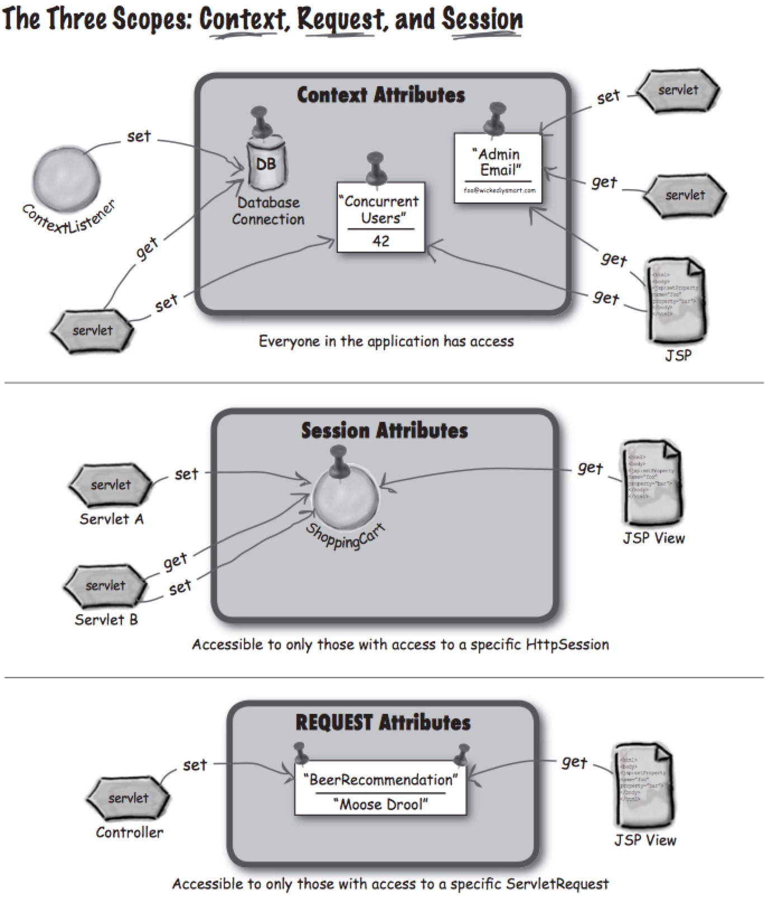

## What is the use of container? ##

When the web server application(Apache) gets a request for a servlet, it dose not send the request to the servlet directly. Actually, the web server will send the request to the container(Tomcat) where the servlet is deployed. The container will send the request to the servlet and call the _doGet()_ and _doPost()_ methods of the servlet.

### Why using container? ###

1. The container knows the protocol between the web server and itself. Using container can avoid working on the API between the servlet and the web server.

2. The container helps the manage the life cycle of the servlet.

3. The container will help to create a new thread for every request for a servlet.

4. Support XML configuration.

5. Convert JSP to real servlet.


## Servlet controlled by container ##

1. The client clicks a link that has a URL to a servlet.

2. The request for the servlet is received by the container. The container creates two objects: HttpServletResponse and HttpServletRequest.

3. The container finds the servlet based on the URL, creates or allocates a thread for the request, and calls the _service()_ method of the servlet, passing the HttpServletResponse and HttpServletRequest as arguments.

4. The _service()_ decides which method (_doPost()_ or _doGet()_) to call based on the request. 

5. The servlet puts the output in the _response_ object and sends it back to the container.

6. The _service()_ completes, the thread dies or returned to the thread pool. The HttpServletResponse and HttpServletRequest dies and the client receives the response.

## Life cycle of Servlet ##

0. When the container starts, it looks for deployed web app and then searches for servlet class files. After that, the class is loaded.

1. _init()_: The container calls _init()_ after the servlet instance is created but before the servlet can serve any request. It gives user a change to initialize the servlet before any request comes in.

2. _service()_: When the request comes in, the container creates a thread and invoke the _service()_ of the servlet. _service()_ will decide whether to use _doPost()_ or _doGet()_ based on the request. Each request runs in a separate thread.

3. _doPost()_ and _doGet()_: The _service()_ will call one of these two methods based on the request.

### Tips ###

The container runs multiple threads for multiple requests to a single servlet.

## Ways to set/get parameters ##

### Request ###
In the POST
```HTTP
POST /advisor/SelectBeerTaste.do HTTP/1.1
......
color=dark&body=heavy
```

```java
request.getParameter(“color”);
request.getParameter(“body”);
......

// Set the attribute on request, and we can forward the request through RequestDispatcher. The target JSP or Servlet can use the request attribute.
request.setAttribute(“styles”, result);

```

### Init Parameters ###

The init parameters can be used by only one servlet.

web.xml
```xml
<servlet>
    <servlet-name> ... </servlet-name>
    ...
    <init-param>
        <param-name>adminEmail</param-name>
        <param-value>likewecare@wickedlysmart.com</param-value>
    </init-param>
</servlet>
```

servlet
```java
getServletConfig().getInitParameter(“adminEmail”);
```

#### Tips ####

The init parameters cannot be used until the servlet is initialized.

### Context init parameters ###

Context init parameters can be used by the entire webapp. 

```xml
<context-param>
    <param-name>adminEmail</param-name>
    <param-value>clientheaderror@wickedlysmart.com</param-value>
</context-param>
```

```java
getServletContext().getInitParameter(“adminEmail”);
```

## Ways to set/get attributes ##

Using servlet context

```java
getServletContext().setAttribute("dog", new Dog());

......

getServletContext().getAttribute("dog");
```

### Scope ###
